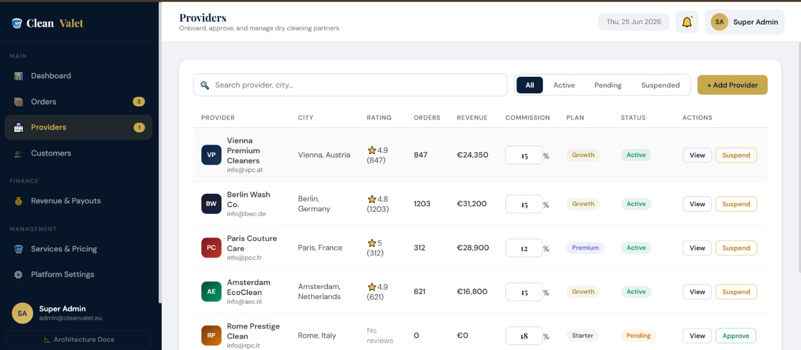

# CleanValet Marketplace Platform

A modern SaaS-style marketplace platform that connects customers with premium dry-cleaning service providers through a centralized booking, provider management, and administrative ecosystem.

---

## Project Overview

CleanValet is a multi-vendor marketplace designed to digitize the dry-cleaning industry. Customers can discover cleaning services, place orders, and track service progress, while providers manage operations through a structured platform and administrators monitor the entire ecosystem from a centralized dashboard.

The project demonstrates marketplace architecture, SaaS product design principles, responsive web interfaces, and administrative workflow management.

---

## Key Features

### Customer Marketplace

* Service Discovery
* Service Booking Workflow
* Order Tracking
* Customer Reviews
* Responsive User Interface
* Mobile-Friendly Experience

### Provider Management

* Provider Onboarding
* Provider Approval Workflow
* Service Management
* Revenue Tracking
* Commission Management
* Performance Monitoring

### Administrative Dashboard

* Dashboard Overview
* Provider Management
* Customer Management
* Order Monitoring
* Revenue & Payouts
* Platform Settings
* Business Analytics

---

## Screenshots

### Homepage


### Admin Control Panel


### Provider Management



---

## Platform Workflow

Customer → Browse Services → Place Order → CleanValet Platform → Service Provider → Order Processing → Order Completion → Customer Feedback

---

## Technology Stack

* HTML5
* CSS3
* JavaScript
* Responsive Design
* SaaS Marketplace Architecture

---

## Project Structure

```text
cleanvalet/
├── index.html
├── admin.html
├── structure.html
├── image/
│   ├── home.png
│   ├── admin dashboard.png
│   └── provider.png
└── README.md
```

---

## Business Model

Customer → CleanValet Platform → Service Provider

Revenue opportunities include:

* Provider Commission Fees
* Premium Provider Subscriptions
* Featured Service Listings
* Marketplace Service Charges

---

## Future Roadmap

* User Authentication
* Provider Login System
* Customer Accounts
* Payment Gateway Integration
* Firebase Backend
* Database Integration
* Mobile Application
* Real-Time Notifications
* AI-Based Recommendations

---

## Author

**Umair Ali**

Computer Engineering Student

Sir Syed University of Engineering and Technology (SSUET)

Karachi, Pakistan

---

## License

This project is intended for educational, portfolio, and learning purposes.
